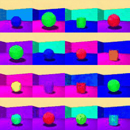
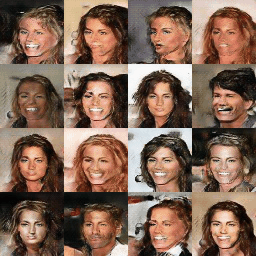

# HoloGAN

This repo is a loose reimplementation of HoloGAN, originally by Nguyen-Phuoc et al: https://arxiv.org/abs/1904.01326

I do not claim or guarantee any correctness of this implementation. This was implemented indepedently without consulting any of the original authors of the paper or other code.

<table>
  <tr valign="top">
    <td width="33%"></td>
    <td width="33%"></td>
    <td width="33%"></td>
  </tr>
</table>

<table>
  <tr valign="top">
    <td width="50%"></td>
    <td width="50%"></td>
  </tr>
</table>

## Dataset

Cars: https://www.tensorflow.org/datasets/catalog/cars196

Shapes3d: https://www.tensorflow.org/datasets/catalog/shapes3d

CelebA: https://www.tensorflow.org/datasets/catalog/celeb_a

LSUN Bedroom: https://www.tensorflow.org/datasets/catalog/lsun

Clevr: https://www.tensorflow.org/datasets/catalog/clevr
